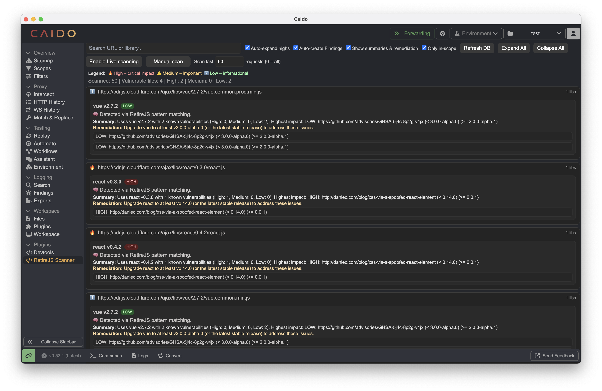
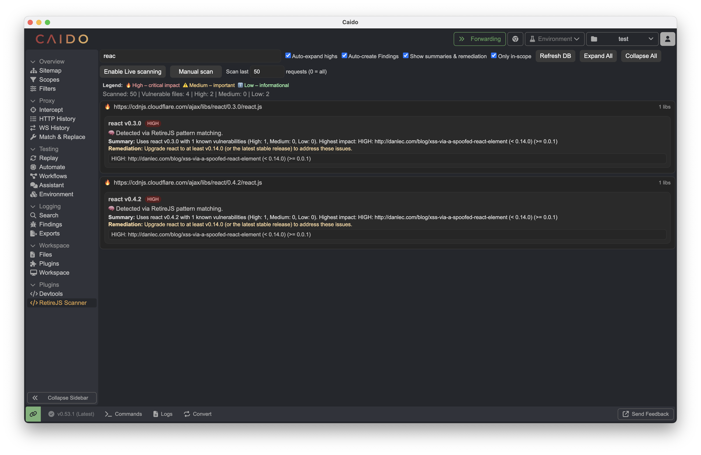
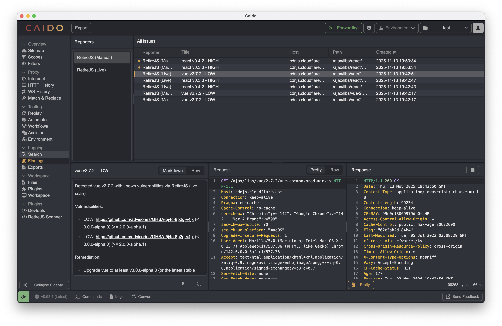
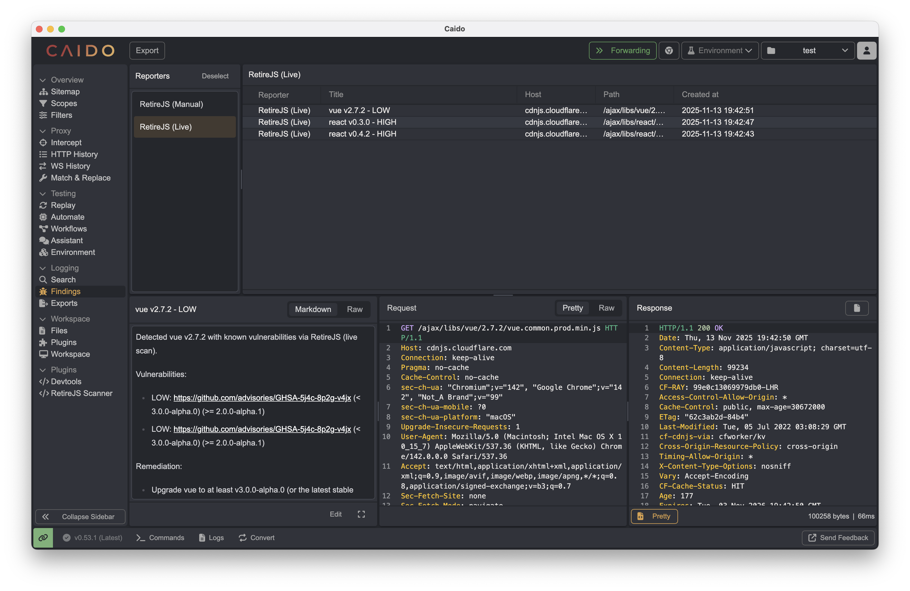

# Retire.js for Caido

Retire.js-like live or manual scanner for Caido: checks request/response URLs, filenames and response bodies with version extraction. 
# Installation
## Manual install
- Navigate to [Releases](https://github.com/bensh/caido-retirejs/releases)
- Download the  plugin_package.zip
- Open Cadio
> Workspace > Plugins > Install Package > select the .zip

## Live scan

RetireJS has the ability to inspect and identifty outdated Javascript libraries on the fly while browsing in real time. 
- Enable the 'Enable Live scanning' buttong from the UI
- Navigate as usual. Any traffic encountered will be flagged by RetireJS and a Caido Finding will be created for it.

## Manual/batch scanning

The UI also features the ability to manually scan the HTTPHistory for outdated libraries. Useful if you forgot to check during the engagement or no longer have access.

Features include:
- Ability to scan different amounts of history depending on speed and recency of history, up to '0' to scan all history, but takes a lot longer.
- Automatically open the accordian of any located Highs.
- Easy to see at a glance different severity via icons.
- Search function to find or filter down particular libraries.
- Auto create a Caido Finding based off what was found in the scan. Separate from any Live Findings also created using Caido's built in filter.
- Show summary of issue and remediation aid in the UI. Included by default in the Findings.
- Ability to only scan 'in-scope' items. If nothing 'in-scope', everything will be scanned.

## Misc

- Refresh Retire.js database.
- Expand and collapse all findings.

## Findings

## Credits

- Retire.js folks for the awesome tool that inspired this plugin and the ever updated database - https://github.com/RetireJS/retire.js
